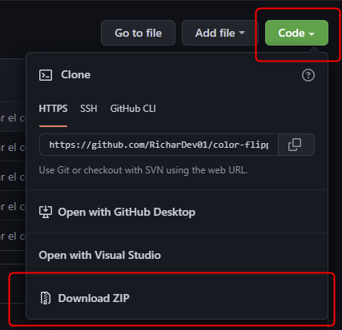
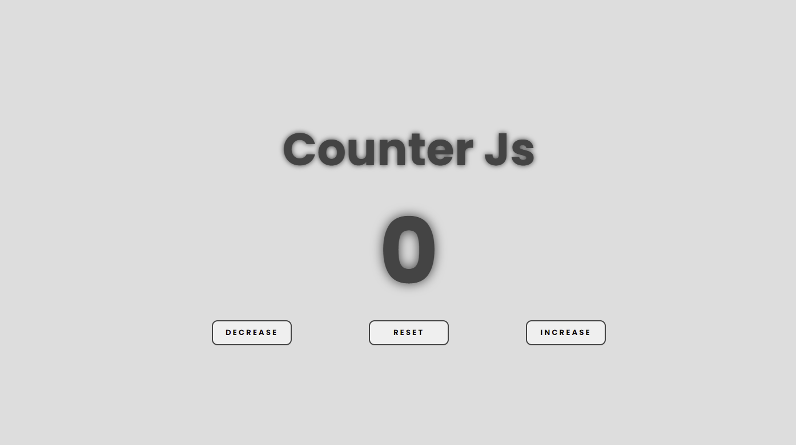
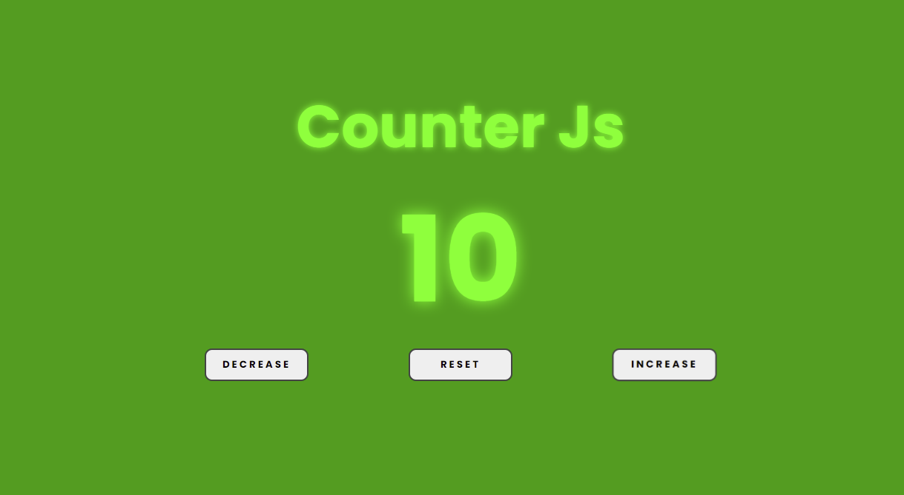
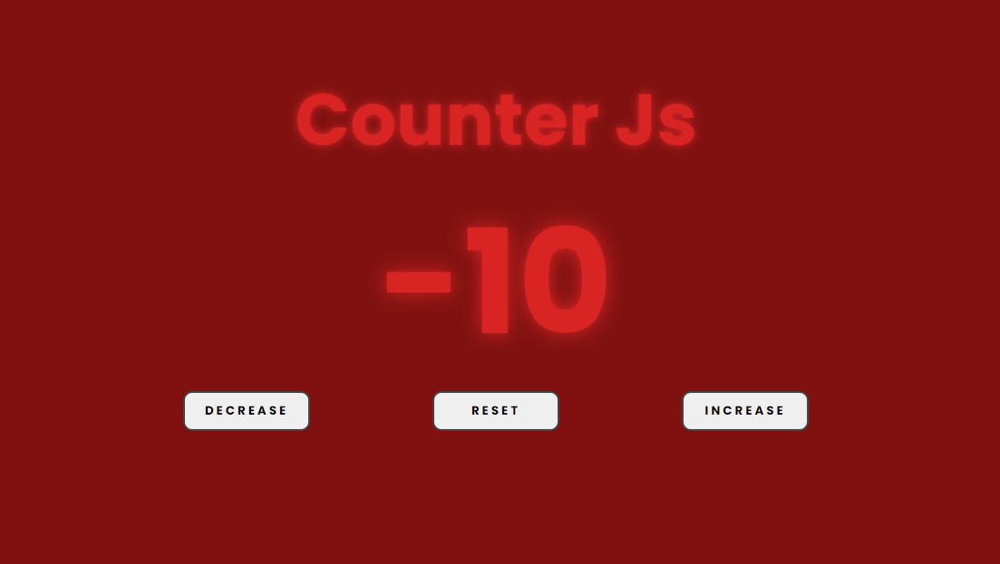

# COUNTER JAVASCRIPT

En este proyecto, realizo una app que me permita incrementar, decrementar y resetear a 0 un numero en pantalla.

Adicionalmente crea la funcionalidad de cambiar de color del numero, si es negativo, cambia a rojo, si es positivo a verde, si es cero, a negro

# COMO VER O USAR LA APP

### para descargarlo y verlo
Solo ve al boton verde que dice 'Code' das click y posteriormente es descargar como .ZIP

### Para Usar
Es bastante simple, solo debes de presionar el boton decrease (disminuir) o reset (regresar a 0) o increase (incrementar)

> PREVIEWS DE LA APP

# TECNOLOGIAS USADAS

- HTML
- CSS
- JAVASCRIPT
